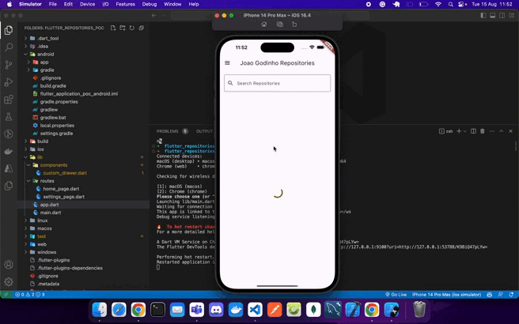
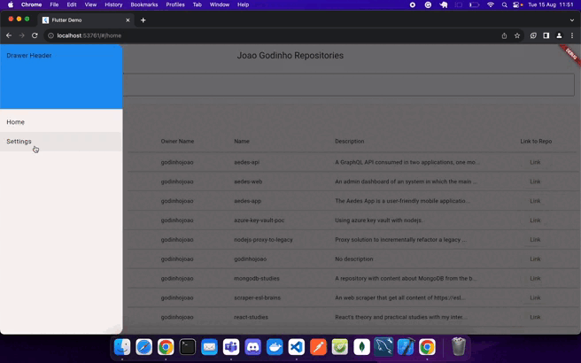

# flutter-repositories-poc

## Table of Contents

- [About](#about)
- [How to Run](#how-to-run)
  - [Prerequisites](#prerequisites)
  - [Steps](#steps)
- [Example Working](#example-working)
  - [iOS](#ios)
  - [Web](#web)
- [Additional Notes](#additional-notes)

## About

A straightforward Flutter POC (Proof of Concept) that operates across multiple platforms using a single codebase. It includes essential features that all apps require, such as a sidebar menu with routing, the capability to navigate outside the application, and API calls.

I'm using the [Github REST API](https://docs.github.com/en/rest?apiVersion=2022-11-28), to fetch my own repositories and show in a paginated table inside the home page.

The primary concept behind this code is its ability to run on multiple platforms including Web, Android, iOS, macOS and others, all from a single codebase. This approach enables us to save both money and time.

## How to Run

To run this Flutter project on your local machine, follow these steps:

### Prerequisites

Before you begin, make sure you have the following installed:

- [Flutter SDK](https://flutter.dev/docs/get-started/install)
- [Dart SDK](https://dart.dev/get-dart)

### Steps

1. **Clone the repository:**

   ```bash
   git clone https://github.com/godinhojoao/flutter-repositories-poc.git
   ```

2. **Navigate to the project directory:**

   ```bash
   cd flutter-repositories-poc
   ```

3. **Install dependencies:**

   ```bash
   flutter pub get
   ```

4. **Run the app:**

   - **Web:**

     ```bash
     flutter run -d web
     ```

   - **Android:**

     Connect an Android device or launch an emulator, then run:

     ```bash
     flutter run -d android
     ```

   - **iOS:**

     Connect an iOS device or launch a simulator, then run:

     ```bash
     flutter run -d ios
     ```

## Example Working

Here are examples of the project in action on different platforms:

### iOS



### Web



## Additional Notes

- Feel free to contribute with this project or to clone it for studying.
